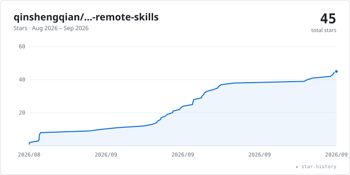

# Overleaf Remote Skill

[](https://github.com/qinshengqian/overleaf-remote-skills/actions/workflows/ci.yml)
[](LICENSE)


Directly edit and manage Overleaf projects from Codex or a terminal. The
bundled enhanced `olcli` sends small, verified remote changes instead of
requiring a download-edit-upload cycle for the whole project.

## Why use it?

- Precisely replace, insert, append, or prepend text in remote documents
- Create folders and text files, and upload binary assets to exact paths
- Compile projects and retrieve PDFs, logs, and BBL files
- Verify saved text and important binary uploads
- Reuse one collaboration connection for a sequence of low-latency edits
- Set up authentication safely on macOS, Linux, and Windows

For an individual edit, the direct commands attempt a compact, versioned OT
update and fall back to verified HTTP replacement only when it is safe. For a
sequence of edits, `olcli live` keeps one collaboration WebSocket open, joins
documents lazily, and sends only the required insert/delete operations.

In one real-project development smoke test, repeated OT edits averaged about
`0.30 s`, compared with `3.03 s` for HTTP replacement—roughly `10×` faster.
This is not a universal benchmark: latency varies with the network, project,
Overleaf instance, and document state.

## Quick start

Requirements: Git, Node.js 18.17 or newer, and an Overleaf account. Codex is
required only when using this repository as a Skill; `olcli` can also be used
directly from a terminal.

### 1. Install the Skill and bundled CLI

macOS/Linux:

```bash
mkdir -p "${CODEX_HOME:-$HOME/.codex}/skills"
git clone https://github.com/qinshengqian/overleaf-remote-skills.git \
  "${CODEX_HOME:-$HOME/.codex}/skills/overleaf-remote"
cd "${CODEX_HOME:-$HOME/.codex}/skills/overleaf-remote"
bash scripts/install_olcli.sh
bash scripts/check_olcli.sh
```

Windows PowerShell:

```powershell
$CodexHome = if ($env:CODEX_HOME) { $env:CODEX_HOME } else { Join-Path $HOME '.codex' }
$SkillDir = Join-Path $CodexHome 'skills\overleaf-remote'
New-Item -ItemType Directory -Force (Split-Path $SkillDir) | Out-Null
git clone https://github.com/qinshengqian/overleaf-remote-skills.git $SkillDir
Set-Location $SkillDir
powershell -ExecutionPolicy Bypass -File .\scripts\install_olcli.ps1
powershell -ExecutionPolicy Bypass -File .\scripts\check_olcli.ps1
```

Start a new Codex task if the Skill is not discovered immediately after
installation.

To update an existing macOS/Linux installation:

```bash
git -C "${CODEX_HOME:-$HOME/.codex}/skills/overleaf-remote" pull --ff-only
bash "${CODEX_HOME:-$HOME/.codex}/skills/overleaf-remote/scripts/install_olcli.sh"
```

On Windows, pull the same directory and run `install_olcli.ps1` again.

### 2. Authenticate securely

Copy only the value of the `overleaf_session2` cookie. Do not include the
cookie name or paste the value directly into a command, where it may be saved
in shell history.

macOS/Linux:

```bash
printf 'Paste Overleaf cookie, then press Return: '
IFS= read -r -s OLCLI_SESSION_COOKIE
printf '\n'
printf '%s' "$OLCLI_SESSION_COOKIE" | olcli auth --stdin
unset OLCLI_SESSION_COOKIE
```

Windows PowerShell:

```powershell
$SecureCookie = Read-Host 'Paste Overleaf cookie, then press Enter' -AsSecureString
$OverleafCookie = [Net.NetworkCredential]::new('', $SecureCookie).Password
$OverleafCookie | olcli auth --stdin
$OverleafCookie = $null
$SecureCookie = $null
```

See the [browser-specific cookie guide](references/setup-and-cookie.md) for
Chrome, Edge, Firefox, and Safari instructions.

### 3. Verify access

```bash
olcli whoami
olcli list --limit 5
```

Do not perform remote mutations if either command fails.

## Choose an editing mode

| Situation | Recommended command | Behavior |
| --- | --- | --- |
| One or a few precise edits | `olcli replace`, `insert`, `append`, or `prepend` | Opens a short-lived connection and verifies the change |
| Several edits in one session | `olcli live "My Paper"` | Reuses one WebSocket and lazily joins documents |
| Require the low-latency path | `olcli live "My Paper" --transport ot` | Fails instead of falling back when OT is unavailable |
| Diagnose an older self-hosted instance | `olcli live "My Paper" --transport http` | Uses verified HTTP document replacement |

## Common commands

```bash
olcli create "My Paper"
olcli mkdir chapters/experiments "My Paper"
olcli write chapters/method.tex "My Paper" --content '\section{Method}'
olcli replace main.tex 'old sentence' 'new sentence' "My Paper"
olcli upload plot.png "My Paper" --to figures/plot.png
olcli compile "My Paper"
olcli pdf "My Paper" --output paper.pdf
```

Precise replacements require a unique match unless `--all` is explicitly
provided. Use a project ID when multiple projects have the same name.

## Persistent real-time editing

Start one authenticated process:

```bash
olcli live "My Paper"
```

It prints a `{"status":"ready",...}` response and then accepts one JSON object
per line:

```json
{"op":"replace","path":"main.tex","search":"old","replacement":"new"}
{"op":"insert","path":"main.tex","anchor":"\\end{document}","text":"Appendix\n","before":true}
{"op":"compile"}
{"op":"quit"}
```

Operations run sequentially. Wait for each JSON response before sending the
next operation. Responses identify the transport, verification state, and
elapsed time. See the [complete command guide](references/commands.md) for all
operations and protocol fields.

## Safety and compatibility

`overleaf_session2` is equivalent to a password. Never commit it, paste it into
issues, include it in screenshots, or store it in this Skill. If it is exposed,
sign out of Overleaf sessions and authenticate again with a fresh cookie. Run
`olcli logout` to clear the locally stored credential.

The client supports the official Overleaf service and can target self-hosted
instances with `--base-url`. Older instances may use a different cookie name
or require HTTP transport; see
[setup and authentication](references/setup-and-cookie.md) and
[troubleshooting](references/troubleshooting.md).

This is an independent project and is not affiliated with or endorsed by
Overleaf. It relies on interfaces used by the Overleaf web application, so an
upstream change may require a compatibility update.

## Documentation and repository layout

- [Skill instructions](SKILL.md)
- [Setup and cookie guide](references/setup-and-cookie.md)
- [Complete command guide](references/commands.md)
- [Troubleshooting](references/troubleshooting.md)

```text
SKILL.md                       Codex Skill entry point
agents/openai.yaml             Codex UI metadata
references/                    Setup, commands, and troubleshooting
scripts/                       macOS/Linux and Windows installers/checkers
assets/olcli/                  Enhanced olcli source, build, and tests
```

## Star history

<picture>
  <source media="(prefers-color-scheme: dark)" srcset="assets/star-history-dark.svg">
  
</picture>

## Attribution and license

The bundled CLI is based on the MIT-licensed
[`aloth/olcli`](https://github.com/aloth/olcli) project and includes its license
and attribution. This repository adds direct remote editing, precise text
operations, nested file management, verification, and persistent low-latency
operation.

Released under the MIT License. See [LICENSE](LICENSE).
